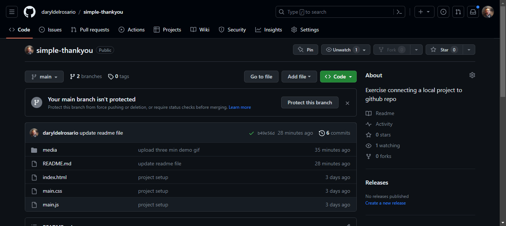

# From Local to Github Repo
Exercise connecting a local project to github repo

## <a href="https://daryldelrosario.github.io/simple-thankyou/">Live Demo</a>
<kbd></kbd>

    
Three Min Demo

- Going from Local Project to Github Repo
<kbd></kbd>

    
Github Host Demo</summery>

- How to host using Github Pages
<kbd></kbd>

